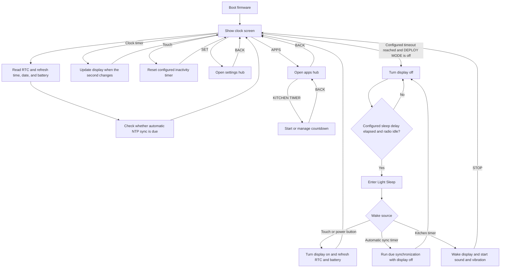
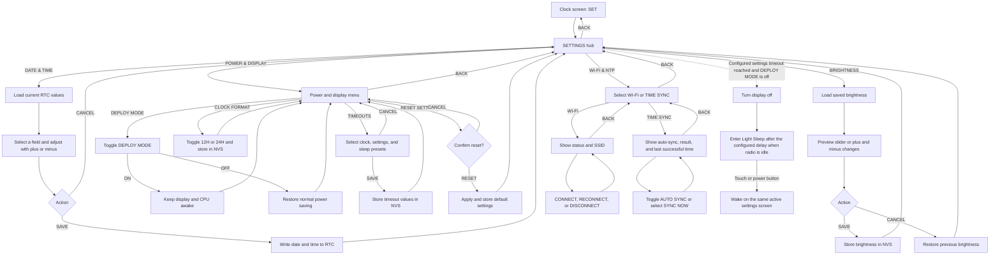
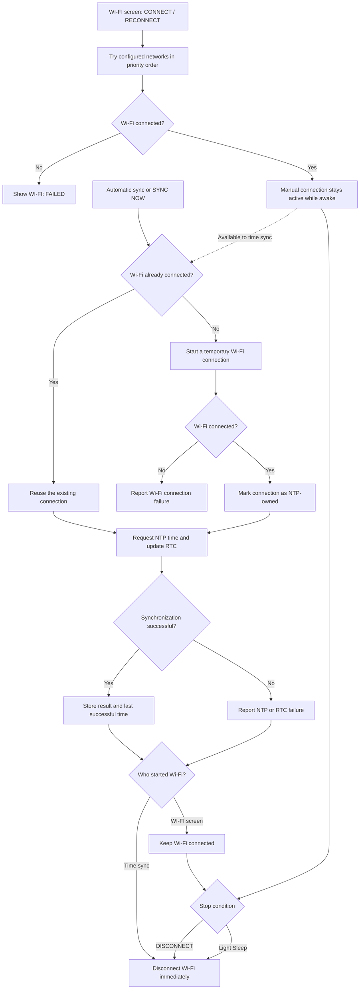
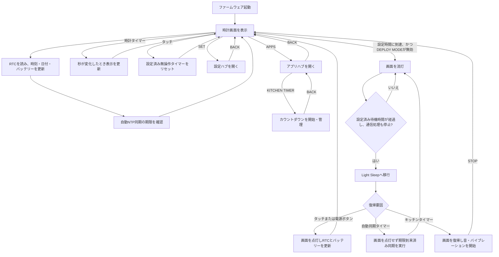
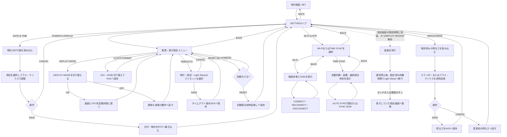
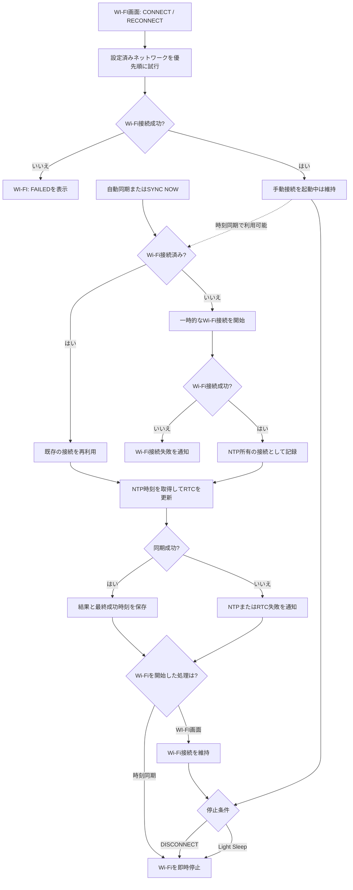

# T-Watch S3 Custom Clock Firmware

Upstream project: [Xinyuan-LilyGO/LilyGoLib-PlatformIO](https://github.com/Xinyuan-LilyGO/LilyGoLib-PlatformIO)

[English](#english) | [日本語](#日本語)

## English

### Overview

This project develops a custom clock firmware for the LilyGo T-Watch S3 while
keeping the upstream factory firmware available as a separate PlatformIO
environment. Custom screens and features live in the local `src` directory and
can be developed without overwriting the factory application sources.

The current custom firmware uses English labels and Japan Standard Time (JST,
UTC+9).

### Implementation status

| Area | Status | Details |
| --- | --- | --- |
| Build foundation | Implemented and build-tested | Pinned Arduino-ESP32 3.3.8 toolchain and separate factory/custom PlatformIO environments |
| Clock face | Implemented and device-tested | Fixed-position time fields, compact `yyyy.mm.dd. ddd` date, and reboot-persistent 12-hour/24-hour selection with AM/PM |
| Custom seven-segment clock font | Implemented and device-tested | 36 px T-Watch Custom Digits derived from DSEG7 Classic Bold, with `b`/`q` forms mapped to `6`/`9`, no clipping, and independent field centering verified |
| RTC | Implemented and device-tested | RTC refresh whenever the clock face appears and a separate manual date/time screen |
| Display timeout | Implemented and partially device-tested | Preset selection, saving, and reboot persistence are device-tested; configured timing remains to be verified |
| Light Sleep | Implemented and partially device-tested | Preset selection and reboot persistence are device-tested; configured timing remains to be verified |
| Deploy mode | Implemented and device-tested | Display-off suppression, firmware upload while enabled, reboot reset, and return to normal display-off and Light Sleep are verified |
| Power on/off | Implemented and device-tested | A non-clipped, left-aligned three-second startup screen precedes the clock; a 4-second crown hold shows a three-second graceful-shutdown screen and powers off through the AXP2101; a 2-second hold powers the watch on; short-press wake remains unchanged |
| Wrist wake | Implemented and build-tested; device verification pending | BMA423 tilt detection wakes the display during both the screen-off delay and Light Sleep while preserving touch, crown, and timer wake sources |
| Battery status | Implemented and device-tested | Compact always-visible upper-left battery, charging, USB-power, and low-battery state |
| Wi-Fi and NTP | Implemented and device-tested | Wi-Fi status, reconnect/disconnect controls, multiple fixed networks, persistent automatic synchronization, manual `SYNC NOW`, RTC update, and ownership-aware radio shutdown |
| Brightness setting | Implemented and device-tested | Separate live-preview screen with `SAVE`/`CANCEL` and NVS persistence |
| Settings hub | Implemented and build-tested | The clock-screen `SET` button opens `DATE & TIME`, `POWER & DISPLAY`, `BRIGHTNESS`, and a grouped `WI-FI & NTP` submenu |
| Restore defaults | Implemented and device-tested | Confirmation screen restores brightness, display timeouts, clock format, and automatic time sync defaults immediately and in NVS |
| Kitchen timer | Implemented and device-tested | Clock-screen `APPS` entry, timer screen, background countdown, Light Sleep timer wake, audible alert, vibration, and alert stop flow |
| Documentation | Implemented | Project-specific English and Japanese README |

### Roadmap

#### Current verification

- [ ] Verify display-off and Light Sleep at every configured timeout preset
- [x] Verify the startup screen, transition to the clock, 4-second power-off,
  graceful-shutdown screen, 2-second power-on, and unchanged short-press wake behavior
- [x] Verify T-Watch Custom Digits legibility, `b`/`q` forms, clipping, and per-field centering in
  both 12-hour and 24-hour modes
- [ ] Verify wrist wake during the screen-off delay and Light Sleep, including
  false-wake behavior and unchanged touch, crown, and timer wake behavior

#### Current milestone: clock and interaction foundation

- [x] Power on/off with a long press of the crown
- [x] Kitchen timer with background countdown, Light Sleep wake, sound, and vibration ([#32](https://github.com/keach/t-watch-s3-custom/issues/32))
- [ ] Japanese font and text-rendering foundation

#### Following milestone: network information

- [ ] Weather forecast API integration and display
- [ ] Gotify background notifications and pop-up display

#### Later candidates

These are possible extensions and are not yet committed requirements.

- Japanese UI or selectable display language
- Selectable timezone instead of fixed JST
- Scheduled alarm: planned ([#49](https://github.com/keach/t-watch-s3-custom/issues/49))
- Pomodoro timer: planned ([#19](https://github.com/keach/t-watch-s3-custom/issues/19))
- Stopwatch: future candidate

### PlatformIO environments

| Environment | Purpose | Source |
| --- | --- | --- |
| `twatchs3` | Upstream factory firmware | LilyGoLib factory example |
| `twatchs3_custom` | This custom clock firmware | `src/main_integrated.cpp` (includes the generated clock foundation from `main.cpp`) |

The factory and custom environments remain independent and can be built in
parallel.

### Requirements

- LilyGo T-Watch S3
- USB data cable
- Visual Studio Code with PlatformIO, or PlatformIO Core
- A supported Python installation for PlatformIO

The project pins the pioarduino ESP32 platform that provides Arduino-ESP32
3.3.8, as required by the current LilyGoLib display APIs.

### Font license

The clock uses T-Watch Custom Digits, a Modified Version derived from
[DSEG7 Classic Bold](https://github.com/keshikan/DSEG). It maps the source
font's `b` and `q` glyphs to `6` and `9`, and redraws `7` with only the top, upper-right, and lower-right segments (A/B/C). The Modified Version does not use
the Reserved Font Name "DSEG" as its primary name. The source font is
Copyright (c) 2020 keshikan and is distributed under the SIL Open Font
License 1.1. The required license text is included in
`src/fonts/DSEG-LICENSE.txt`.

After downloading the official DSEG7 Classic Bold TTF, regenerate the
embedded 36 px subset with:

```sh
node support/generate_clock_font.mjs /path/to/DSEG7Classic-Bold.ttf
```

Only `-` and `0` through `9` are embedded in the firmware. During regeneration, the script also replaces `7` with the project-specific A/B/C-segment bitmap.

### Wi-Fi configuration

Copy the example credentials file:

```sh
cp include/wifi_credentials.example.h include/wifi_credentials.h
```

Edit `include/wifi_credentials.h` and add trusted networks in priority order:

```cpp
inline constexpr WiFiCredential kWiFiCredentials[] = {
    {"HOME_WIFI", "home-password"},
    {"MOBILE_HOTSPOT", "hotspot-password"},
};
```

Add or remove entries as needed, then keep `kWiFiCredentialCount` as shown in
the example file. The real credentials file is excluded from Git. When it is
absent, the firmware still builds and operates with Wi-Fi/NTP disabled.

The ESP32-S3 supports 2.4 GHz Wi-Fi only. Configure a 2.4 GHz network or a
dual-band SSID that is also available on 2.4 GHz; a 5 GHz-only SSID cannot be
used.

### Build

Build the custom firmware:

```sh
pio run -e twatchs3_custom
```

The main output is generated at:

```text
.pio/build/twatchs3_custom/firmware.bin
```

The upstream factory firmware can still be built separately:

```sh
pio run -e twatchs3
```

### Upload to the watch

Connect the watch over USB and run:

```sh
pio run -e twatchs3_custom -t upload
```

If automatic port detection is unavailable, specify the port explicitly:

```sh
pio run -e twatchs3_custom -t upload --upload-port /dev/cu.usbmodemXXXXXX
```

If upload reports `No serial data received` while the installed firmware is in
Light Sleep, wake the display and run the upload command again.

### Clock and power behavior

#### Clock display, screen-off, and wake flow



- Use `SET` on the clock screen to open the settings hub.
- Use `APPS` to open the apps hub and enter the kitchen timer without going through settings. The countdown continues in the background; expiry wakes the watch from Light Sleep and starts sound and vibration until stopped.
- Select `DATE & TIME`, `POWER & DISPLAY`, `BRIGHTNESS`, or `WI-FI & NTP` in
  the hub. The `WI-FI & NTP` submenu opens the existing `WI-FI` and
  `TIME SYNC` screens. `SAVE`, `CANCEL`, and `BACK` return through the
  corresponding parent screen; the hub's `BACK` returns to the clock.
- `POWER & DISPLAY` provides DEPLOY MODE, display timeout presets, persistent
  12-hour/24-hour selection, and a confirmation screen for restoring defaults.
- While DEPLOY MODE is enabled, the display and CPU stay awake, and a `DEPLOY`
  indicator remains visible on the clock. Disable it to restore normal power
  saving; a reboot always clears the mode.
- Brightness changes are previewed immediately; `SAVE` persists the value to
  NVS and `CANCEL` restores the previous value.
- Clock timeout presets are 10, 15, 30, 60, and 120 seconds; the default is
  15 seconds.
- Settings timeout presets are 30, 60, 120, and 300 seconds; the default is
  60 seconds.
- Light Sleep delay presets are 5, 10, 30, and 60 seconds; the default is
  5 seconds.
- Restoring defaults resets brightness, the three timeout values, clock format,
  and automatic time synchronization. It does not change RTC time, compile-time
  Wi-Fi credentials, or NTP synchronization history.
- A touch or a short power-button press wakes the watch.
- When automatic time synchronization is enabled, an internal timer can wake
  the watch without turning on the display to perform a due synchronization.
- The wake touch is consumed so it does not accidentally activate a control.
- RTC time and battery state are refreshed after wake.
- A compact battery or power status remains visible at the upper left.

### Settings flow



### Wi-Fi and NTP behavior

#### Connection and synchronization flow



- The `WI-FI` screen shows `OFF`, `CONNECTING`, `CONNECTED`, or `FAILED`, plus
  the connected or currently attempted SSID.
- `CONNECT` tries the configured networks in priority order. When already
  connected, the same button becomes `RECONNECT` and starts a fresh attempt.
- `DISCONNECT` cancels a manual connection attempt or stops an established
  connection immediately.
- A successful manual connection remains available while the watch is awake.
  A due automatic synchronization or `SYNC NOW` reuses it without reconnecting
  and leaves it connected when synchronization finishes.
- A manual connection is shut down when the watch enters Light Sleep.
- The last successful NTP synchronization epoch is stored in ESP32 NVS.
- Synchronization is due when no history exists, RTC time is invalid, at least
  24 hours have elapsed, or the clock has moved behind the previous sync time.
- Wi-Fi is powered only when synchronization is due or `SYNC NOW` is selected.
- Registered networks are attempted in order, with 10 seconds per network.
- NTP is allowed 15 seconds after a Wi-Fi connection is established.
- Failed automatic attempts are suppressed for 15 minutes, then retried by a
  Light Sleep timer without requiring a display wake.
- The `TIME SYNC` screen provides a persistent automatic-sync toggle,
  `SYNC NOW`, the current or most recent result, and the last successful time.
- `SYNC NOW` bypasses both the 24-hour interval and a pending 15-minute retry
  delay. It remains available when automatic synchronization is disabled.
- A connection started temporarily by time synchronization is shut down when
  synchronization finishes. A pre-existing manual connection is preserved.
- A successful NTP result is written to the hardware RTC, persisted to NVS,
  and followed by Wi-Fi shutdown to reduce power consumption.
- Wi-Fi and NTP activity appears as a bottom notification, such as
  `CONNECTING WIFI 1/2`, `SYNCING TIME`, or `TIME SYNCED`.
- Success notifications disappear after 3 seconds; failure and configuration
  warnings disappear after 8 seconds. A current NTP state produces no notice.

### Security notes

- Never commit `include/wifi_credentials.h`.
- Do not put real SSIDs or passwords in the example file.
- Verify `git status` before committing or pushing changes.

---

## 日本語

### 概要

このプロジェクトでは、LilyGo T-Watch S3向けの独自時計ファームウェアを
開発します。上流の工場出荷ファームウェアは別のPlatformIO環境として維持し、
独自の画面と機能はローカルの`src`ディレクトリで開発します。そのため、工場出荷
アプリケーションのソースを上書きせず、平行して保守できます。

現在のカスタムファームウェアは英語表示で、日本標準時（JST、UTC+9）を使用します。

### 実装状況

| 領域 | 状況 | 内容 |
| --- | --- | --- |
| ビルド基盤 | 実装・ビルド確認済み | Arduino-ESP32 3.3.8の固定と、factory/customを分離したPlatformIO環境 |
| 時計画面 | 実装・実機確認済み | 位置を固定した時刻欄、コンパクトな`yyyy.mm.dd. ddd`日付、再起動後も保持されるAM/PM付き12時間・24時間表示の選択 |
| 独自7セグ風時計フォント | 実装・実機確認済み | DSEG7 Classic Boldを元にした36pxのT-Watch Custom Digitsを使用し、`6`/`9`へ`b`/`q`形を割り当て、文字切れがないことと項目ごとの中央揃えを確認済み |
| RTC | 実装・実機確認済み | 時計画面表示時のRTC再読込と、独立した日付・時刻手動設定画面 |
| 画面消灯 | 実装・一部実機確認済み | プリセットの変更・保存と再起動後の保持は確認済み。設定時間どおりの動作は確認待ち |
| Light Sleep | 実装・一部実機確認済み | プリセットの変更と再起動後の保持は確認済み。設定時間どおりの動作は確認待ち |
| デプロイモード | 実装・実機確認済み | 画面消灯の抑止、有効中の実機書き込み、再起動時の解除、通常の画面消灯・Light Sleepへの復帰を確認済み |
| 電源オン・オフ | 実装・実機確認済み | 見切れのない左上寄せの起動画面を時計画面の前に3秒表示。竜頭を4秒長押しするとgraceful shutdown画面を3秒表示してAXP2101経由で電源を切り、電源オフ中は2秒長押しで起動。短押しの画面復帰も従来どおり |
| 手首動作での画面復帰 | 実装・ビルド確認済み、実機確認待ち | BMA423の傾き検知により、画面消灯後の待機中とLight Sleep中の両方で画面を復帰。タッチ・竜頭・タイマーによる復帰も維持 |
| バッテリー状態 | 実装・実機確認済み | 左上に常時表示する簡潔な残量、充電、USB給電、低残量表示 |
| Wi-Fi・NTP | 実装・実機確認済み | Wi-Fi状態、再接続・切断操作、複数固定ネットワーク、自動同期の永続化、手動`SYNC NOW`、RTC更新、接続元に応じたWi-Fi停止 |
| 明るさ設定 | 実装・実機確認済み | 即時プレビュー、`SAVE`/`CANCEL`、NVS永続化を備えた独立画面 |
| 設定ハブ | 実装・ビルド確認済み | 時計画面の`SET`から`DATE & TIME`、`POWER & DISPLAY`、`BRIGHTNESS`、および`WI-FI & NTP`サブメニューを開く構成 |
| 設定初期化 | 実装・実機確認済み | 確認画面を経て、明るさ・画面時間・時計形式・NTP自動同期を即時およびNVS上で初期値へ戻す |
| キッチンタイマー | 実装・実機確認済み | 時計画面の`APPS`導線、タイマー画面、バックグラウンドカウントダウン、Light Sleep中の期限到達・復帰、音・バイブレーション通知、停止操作 |
| ドキュメント | 実装済み | このプロジェクト専用の英語・日本語README |

### ロードマップ

#### 現在の実機確認

- [ ] すべての設定プリセットどおりに画面消灯・Light Sleepへ移行することを確認
- [x] 起動画面と時計画面への遷移、4秒長押しによる電源オフ、
  graceful shutdown画面、2秒長押しによる電源オン、および短押しの
  画面復帰が従来どおりであることを確認
- [x] 12時間・24時間表示の両方で、T-Watch Custom Digitsの視認性、
  `b`/`q`形、文字切れ、項目ごとの中央揃えを確認
- [ ] 画面消灯後の待機中とLight Sleep中に手首動作で復帰すること、
  誤復帰の傾向、およびタッチ・竜頭・タイマー復帰に影響がないことを確認

#### 現在のマイルストーン：時計・操作基盤の仕上げ

- [x] 竜頭長押しによる電源オン・オフ
- [x] バックグラウンド動作、Light Sleep復帰、音・バイブレーション通知を備えたキッチンタイマー（[#32](https://github.com/keach/t-watch-s3-custom/issues/32)）
- [ ] 日本語フォント・表示基盤

#### 次のマイルストーン：ネットワーク情報

- [ ] 天気予報APIからの取得と画面表示
- [ ] Gotifyのバックグラウンド通知とポップアップ表示

#### 将来の候補

以下は拡張候補であり、まだ確定要件ではありません。

- 日本語UIまたは表示言語の選択
- JST固定ではなくタイムゾーンを選択する設定
- 指定時刻アラーム：計画済み（[#49](https://github.com/keach/t-watch-s3-custom/issues/49)）
- ポモドーロタイマー：計画済み（[#19](https://github.com/keach/t-watch-s3-custom/issues/19)）
- ストップウォッチ：将来候補

### PlatformIO環境

| 環境 | 用途 | ソース |
| --- | --- | --- |
| `twatchs3` | 上流の工場出荷ファームウェア | LilyGoLibのfactory example |
| `twatchs3_custom` | このプロジェクトの時計ファームウェア | `src/main_integrated.cpp`（`main.cpp`由来の生成済み時計基盤を取り込む） |

工場出荷版とカスタム版は独立しており、平行してビルドできます。

### 必要なもの

- LilyGo T-Watch S3
- データ通信対応USBケーブル
- Visual Studio CodeとPlatformIO、またはPlatformIO Core
- PlatformIOが対応するPython環境

現在のLilyGoLibの画面APIに必要なArduino-ESP32 3.3.8を使用するため、
pioarduinoのESP32プラットフォームを固定しています。

### フォントライセンス

時計には、[DSEG7 Classic Bold](https://github.com/keshikan/DSEG)を元にした
Modified Version「T-Watch Custom Digits」を使用します。元フォントの`b`と`q`を
`6`と`9`へ割り当て、`7`は上・右上・右下（A・B・C）の3セグメントだけで描画しています。Modified Versionの主要名称にはReserved Font Name
「DSEG」を使用しません。元フォントはCopyright (c) 2020 keshikanで、SIL Open
Font License 1.1の下で配布されています。必要なライセンス全文は
`src/fonts/DSEG-LICENSE.txt`に収録しています。

公式のDSEG7 Classic Bold TTFを取得後、次のコマンドで組み込み用36pxサブセットを
再生成できます。

```sh
node support/generate_clock_font.mjs /path/to/DSEG7Classic-Bold.ttf
```

ファームウェアには`-`と`0`〜`9`だけを組み込んでいます。再生成時には、スクリプトが`7`をプロジェクト独自のA・B・Cセグメントのビットマップへ置換します。

### Wi-Fi設定

認証情報のサンプルをコピーします。

```sh
cp include/wifi_credentials.example.h include/wifi_credentials.h
```

`include/wifi_credentials.h`を編集し、優先順位の高い順にネットワークを
登録します。

```cpp
inline constexpr WiFiCredential kWiFiCredentials[] = {
    {"HOME_WIFI", "home-password"},
    {"MOBILE_HOTSPOT", "hotspot-password"},
};
```

必要に応じて項目を追加・削除し、`kWiFiCredentialCount`はサンプルと同じ
計算式のまま使用してください。実際の認証情報ファイルはGit管理から除外されます。
ファイルが存在しない場合もビルドでき、Wi-Fi・NTP同期なしで時計が動作します。

ESP32-S3が対応するWi-Fiは2.4 GHz帯のみです。2.4 GHzのネットワーク、または
2.4 GHzでも提供される共通SSIDを設定してください。5 GHz専用SSIDには接続できません。

### ビルド

カスタムファームウェアをビルドします。

```sh
pio run -e twatchs3_custom
```

主な生成物は次の場所に作成されます。

```text
.pio/build/twatchs3_custom/firmware.bin
```

上流の工場出荷ファームウェアも別環境でビルドできます。

```sh
pio run -e twatchs3
```

### 実機への書き込み

時計をUSB接続して、次を実行します。

```sh
pio run -e twatchs3_custom -t upload
```

ポートが自動検出されない場合は明示的に指定します。

```sh
pio run -e twatchs3_custom -t upload --upload-port /dev/cu.usbmodemXXXXXX
```

インストール済みファームウェアがLight Sleep中で、書き込み時に
`No serial data received`と表示された場合は、画面を復帰させてから書き込み
コマンドを再実行してください。

### 時計・省電力動作

#### 時計表示・消灯・復帰フロー



- 時計画面の`SET`から設定ハブを開きます。
- `APPS`から設定ハブを経由せずアプリハブを開き、キッチンタイマーへ移動できます。カウントダウンはバックグラウンドでも継続し、期限到達時はLight Sleepから復帰して、停止するまで音とバイブレーションで通知します。
- ハブで`DATE & TIME`、`POWER & DISPLAY`、`BRIGHTNESS`、`WI-FI & NTP`の
  いずれかを選択します。`WI-FI & NTP`サブメニューから、既存の`WI-FI`画面と
  `TIME SYNC`画面へ移動します。`SAVE`、`CANCEL`、`BACK`は対応する親画面へ戻り、
  ハブの`BACK`は時計画面へ戻ります。
- `POWER & DISPLAY`では、DEPLOY MODE、各種タイムアウトのプリセット、
  永続化される12時間・24時間表示、確認画面付きの設定初期化を操作できます。
- DEPLOY MODEの有効中は画面とCPUを起動状態に保ち、時計画面へ`DEPLOY`を
  表示します。解除すると通常の省電力動作へ戻り、再起動した場合も必ず解除されます。
- 明るさは操作中に即時反映され、`SAVE`でNVSへ保存、`CANCEL`で変更前の値へ
  戻ります。
- 時計画面の消灯時間は10、15、30、60、120秒から選択でき、初期値は15秒です。
- 設定画面の消灯時間は30、60、120、300秒から選択でき、初期値は60秒です。
- Light Sleepまでの待機時間は5、10、30、60秒から選択でき、初期値は5秒です。
- 設定初期化では明るさ、3種類のタイムアウト、時計形式、NTP自動同期を初期値へ
  戻します。RTC時刻、ビルド時に設定するWi-Fi認証情報、NTP同期履歴は変更しません。
- タッチまたは電源ボタンの短押しで復帰します。
- 自動時刻同期が有効な場合、内部タイマーが画面を点灯せずに時計を復帰させ、
  期限に達した同期を実行できます。
- 復帰に使ったタッチは吸収され、背後のボタンを誤操作しません。
- 復帰時にRTC時刻とバッテリー状態を更新します。
- 左上には簡潔なバッテリー・給電状態を常時表示します。

### 設定画面フロー



### Wi-Fi・NTP動作

#### 接続・時刻同期フロー



- `WI-FI`画面には`OFF`、`CONNECTING`、`CONNECTED`、`FAILED`の状態と、
  接続中または接続を試行しているSSIDを表示します。
- `CONNECT`は設定済みネットワークを優先順に試します。接続済みの場合、同じ
  ボタンが`RECONNECT`となり、新しい接続試行を開始します。
- `DISCONNECT`は手動接続の試行を中止するか、確立済みの接続を即時停止します。
- 手動接続に成功すると、時計が起動中の間は接続を維持します。期限に達した
  自動同期または`SYNC NOW`は、再接続せずその接続を再利用し、同期完了後も
  接続を維持します。
- 手動接続は、Light Sleepへ移行するときに停止します。
- 最後にNTP同期した時刻をESP32のNVSへ保存します。
- 同期履歴がない、RTC時刻が無効、前回同期から24時間以上経過、または時計が
  前回同期時刻より前へ戻った場合に同期が必要と判定します。
- 同期が必要な場合、または`SYNC NOW`を選択した場合だけWi-Fiを起動します。
- 登録されたネットワークを順番に試し、1ネットワークにつき10秒待ちます。
- Wi-Fi接続後、NTPの応答を15秒待ちます。
- 自動同期で全候補が失敗した場合は15分間再試行を抑制し、その後はLight Sleepの
  タイマーで画面復帰を必要とせず再試行します。
- `TIME SYNC`画面には、永続化される自動同期の有効・無効、`SYNC NOW`、
  現在または直近の結果、最後に成功した同期時刻を表示します。
- `SYNC NOW`は24時間間隔と15分の再試行待機を無視します。自動同期が無効でも
  手動同期は使用できます。
- 時刻同期が一時的に開始した接続は同期完了時に停止します。すでに存在していた
  手動接続は維持します。
- NTP同期成功後はハードウェアRTCとNVSを更新し、省電力のためWi-Fiを停止します。
- Wi-Fi・NTPの動作は下段へ`CONNECTING WIFI 1/2`、`SYNCING TIME`、
  `TIME SYNCED`などの通知として表示します。
- 成功通知は3秒、失敗・未設定通知は8秒で消えます。NTPが最新の定常状態では
  通知を表示しません。

### セキュリティ上の注意

- `include/wifi_credentials.h`をコミットしないでください。
- サンプルファイルに実際のSSIDやパスワードを書かないでください。
- コミットやpushの前に`git status`を確認してください。
